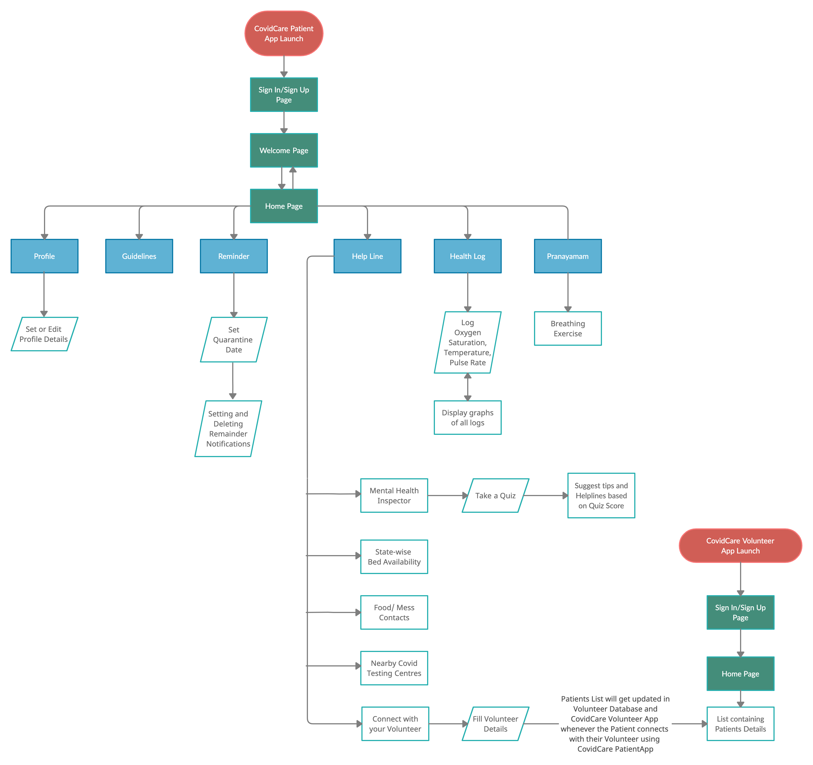

# CovidCare
  ## **Title of the project:** 
 Covid Home Management of Mild and Moderate Infections
 
  
 
 ## **Description:** 
	
CovidCare is a mobile application which acts as a **comprehensive guide and aid for infected people**, eligible for home quarantine, and normal  users. The application helps to keep all the required data in one place and makes it easily accessible and available to the public.

### **Features:**
- **Reminders**

	Patients under home quarantine are prescribed certain medications  to be taken on a daily basis that help control the infection. The timely reminders in the application will notify the patients to regularly take their medications.

- **Quarantine tracking**

	The patient can keep track of the number of days they have been in quarantine in the app bar.

- **Mental Health Inspector**

	Social isolation and quarantine can be mentally stressful. By taking the Mental Health Quiz one can be aware of their mental state and contact a counsellor if required.

- **Covid Meals/Food contacts**

	The infected patients are usually in a very tired and exhuasted state. Making their own meals would be difficult. The contacts provided in the Helplines deliver meals to the patient's address.

- **Health Logs**

	During quarantine it is necessary to monitor the patient's vitals. The patient can log their Oxygen Saturation level (SpO2), Temperature, Pulse rate daily and view them as graphs. If the SpO2 is below 95% they are alerted and redirected to the Helplines page.
	
- **Covid Bed Availability**

	In case of severe infection, the patient may need to be admitted to a hospital for further care and treatment. The links of websites (state-wise), regularly updated by Government Organisation, available in the Helplines would prove to be very useful.
	
- **Nearby Covid Testing Centres**

	Once the quarantine is over, it is essential to perform a test and confirm that the patient is now free of infection. The patient can view nearby testing centres and contact them to book a test.
	
- **Contact Volunteer and CovidCare Volunteer app**

	As the patient is quarantined they cannot go outside to buy essentials, for which a volunteer is assigned to them. Once the patient is notified of their volunteer's details, they can use the app to connect with the volunteer. On the other side, a volunteer can use the CovidCare Volunteer app to login and view the volunteers that have been assigned to them along with their address and phone number.
	
- **Pranayama**

	It has been scientifically proven that Pranayama increases lung capacity and boosts immunity. The app provides a virtual assist and encourages the patient to perform breathing exercises daily.
	
- **Guidelines**

	The guidelines released by the Indian Government for covid patients and caregivers is available in the app bar. In case the government releases new guidelines, it will also be available in the updated app.

## **Hardware and Software requirements:**
- Flutter v1.22.2
- Dart v2.10.2
- Firebase
- IDE used: Visual Studio Code

## **Process Flow:**

## **Data Flow Diagram**

 
